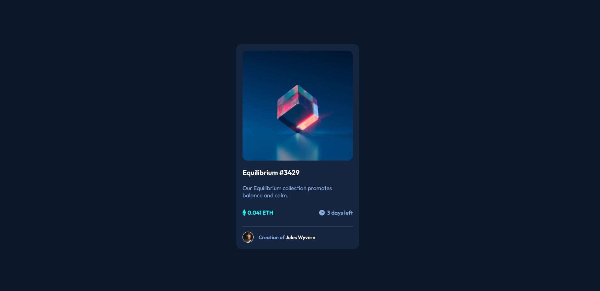

## Table of contents

- [Overview](#overview)
  - [Screenshot](#screenshot)
  - [Links](#links)
- [My process](#my-process)
  - [Built with](#built-with)
  - [What I learned](#what-i-learned)
- [Author](#author)
- [Acknowledgments](#acknowledgments)

## Overview

### Screenshot

### Links

- Solution URL: [https://github.com/IIamTyZen/nft-preview-card](https://github.com/IIamTyZen/nft-preview-card)
- Live Site URL: [https://iiamtyzen.github.io/nft-preview-card/](https://iiamtyzen.github.io/nft-preview-card/)

## My process

I started by structuring my HTML to fill my css variables and then code all the CSS

### Built with

- HTML5 
- CSS 
- Flexbox
- Media queries 

### What I learned

With this project I was able to work mostly on flexbox, with some media queries and of course HTML5 and CSS

## Author

- Website - [Soon](Soon)
- Twitter - [@IamTyZ3n](https://www.twitter.com/IamTyZ3n)
- Discord - [TyZen#2406](TyZen#2406)

## Acknowledgments

Please do not redistribute or copy the code without my permission.
